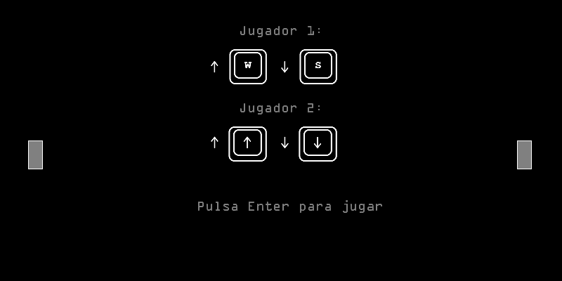

# Pong Game - Creando interfaces de usuario
The pong game made with [processing](https://processing.org/)

## Autor 
**Doramas Báez Bernal**  
Correo: doramas.baez101@alu.ulpgc.es

## Gif

  
  

    Figura 1: Ejemplo de ejecucion del pong
  

## Índice
* [Introducción](#introducción)
* [Dependencias](#dependencias) 
* [Desarrollo](#desarrollo)
    * [Información general](#informaciónGeneral)
    * [Sonido](#sonido)
    * [Rebotes](#rebotes)
* [Referencias](#referencias)

## Introducción
El objetivo de la práctica es familiarizarse con processing, para ello, vamos a desarrollar el pong o un juego muy similar al pong. El juego está pensado para dos jugadores, donde cada jugador dispondrá de su propia raqueta con la cual podrá interactuar con la pelota. Con el objetivo de marcar un punto al contrario, podemos asemejar este juego al tenis.   
En este caso se ha optado por intentar asemejarse lo máximo posible al pong original, incluso utilizando sonidos de 8 bits!

## Dependencias
Para el desarrollo de la práctica se han utilizado las siguientes librerías:
* La librería **sound** que se utiliza para la reproducción del sonido. Para su instalación seguir los pasos del guión de la práctica.
* La librería **GifAnimation** que se utilizó para la obtención del gif. Sin embargo, ya que no es necesario para el funcionamiento de la aplicación en este caso todo el código relacionado se encuentra comentado. No obstante, por si fuera necesario, en el siguiente [enlace](https://github.com/extrapixel/gif-animation) se encuentra la guía de instalación.

## Desarrollo

### Información general 

Cuando comienza el juego, aparecerá una ventana principal donde se explicarán las instrucciones. En esta vista, se puede observar que los controles son los siguientes: 
- Jugador1: up = w, down = s
- Jugador2: up = flecha arriba, down = flecha abajo
Luego, comenzará el juego hasta el infinito (nuestro modelo de negocio es tener al jugador el máximo tiempo posible enganchado). Además, comentar que la bola siempre saldrá hacia el que ha marcado el último punto (imitando al pong).

### Sonido
Se han utilizado sonidos de 8 bits, del [pong original](https://www.youtube.com/watch?v=fiShX2pTz9A). Con la intención de recordarnos a dicho juego y así volver a esos años 70s

### Rebotes
Existen dos posibles rebotes:
* Rebote en el eje y: Se dará este caso cuando la pelota se sale del campo por el eje y. Para solucionar dicho problema, invertiremos la velocidad que tiene la propia bola para ese eje.
* Rebote con las palas: En este caso, dependiendo de la zona con la que choque la bola se aplicaran distintas soluciones. Por ejemplo, si la bola choca con los 5 pixeles superiores de la raqueta, se aplicará una velocidad negativa o positiva dependiendo de con que jugador se corresponda, para simular los ángulos que se producen en el pong original. Por otra parte, si choca en la zona intermedia, se mantendrá la inercia que ya tenía.

## Referencias

* [Guion de prácticas](https://cv-aep.ulpgc.es/cv/ulpgctp20/pluginfile.php/126724/mod_resource/content/22/CIU_Pr_cticas.pdf)
* [processing.org](https://processing.org/)
* [sonidos](https://freesound.org/home/)
* [GifAnimation](https://github.com/extrapixel/gif-animation)

